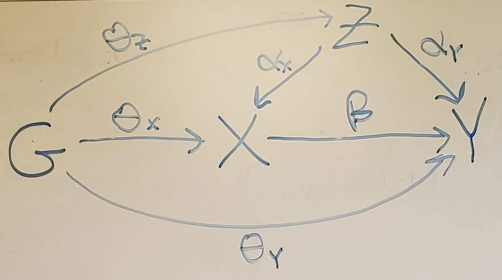

 
```{r packages, echo=FALSE}
library("DiagrammeR")
library("ggplot2")
library("ggpubr")
library("qvalue")
library(cowplot)

# colorblind-friendly palette
cbPalette <- c("#88CCEE", "#CC6677", "#DDCC77", "#117733", "#332288", "#AA4499", 
               "#44AA99", "#999933", "#882255", "#661100", "#6699CC", "#888888", "#000000")
```

```{r plotcode, echo=FALSE}
# check if this is a pip method
pip_checker = function(method) {
  return(grepl('susie', method) || grepl('mrash', method) || grepl('zuber', method) || grepl('brms', method) || grepl('varbvs', method) || grepl('vebboost', method) || grepl('ctwas', method) || grepl('famr', method))
}

# Plot per-variable bar showing true/false positive rate
group_barchart = function(dirname, prefix='all_res_', n_x_show = 8, thresh = 0.05,
                          pip_thresh = 0.95, methods=c(), oldpip=F) {
  method_labels = c()
  beta_labels = c()
  all_pos_rates = c()

  for(m in methods) {
    fname = paste0(dirname, prefix, m, '.txt')
    res = na.omit(read.table(fname))
    num_cols = dim(res)[2]
    ss = strsplit(m, '_')[[1]][1]  # isolate the second-stage method name
    if(pip_checker(ss)) {
      num_betas = num_cols
      if(!oldpip) {
        res = res[, (num_betas/3*2+1):ncol(res)]
      }
    } else {
      num_betas = num_cols / 3
    }

    # compute rates of (true or false) positives
    for (i in 1:n_x_show) {
      if(pip_checker(ss)) {
        posrate = sum(res[,i] >= pip_thresh) / length(res[,i])
      } else {
        posrate = sum(res[,(i+num_betas*2)] <= thresh) / length(res[,(i+num_betas*2)])
      }
      method_labels = c(method_labels, m)
      beta_labels = c(beta_labels, as.character(i))
      all_pos_rates = c(all_pos_rates, posrate)
    }
  }

  data = data.frame(method_labels, beta_labels, all_pos_rates)
  ggplot(data, aes(fill=method_labels, y=all_pos_rates, x=beta_labels)) +
    geom_bar(position="dodge", stat="identity") +
    geom_hline(yintercept=0.05, linetype="dashed", color = "black") +
    scale_fill_manual(values=cbPalette) + theme(text = element_text(size = 20)) +
    xlab('Exposures') + ylab('Positive Rate') + labs(fill = "Method") + ylim(0, 1)
}


# stacked bar plot showing true and false positives, similar to cTWAS paper
stacked_barplot = function(dirname, truevars, prefix='all_res_', thresh = 0.05,
                           pip_thresh = 0.5, methods=c(), oldpip=F, use_qval=F,
                           labels=c()) {
  method_labels = c()
  counts = c()
  tf_labels = c()  # whether true or false
  truevars = as.numeric(unlist(strsplit(truevars, ",")))

  for(m in methods) {
    if(length(labels) > 0) {
      lab = labels[which(methods == m)]
    } else {
      lab = m
    }
    fname = paste0(dirname, prefix, m, '.txt')
    res = na.omit(read.table(fname))
    ss = strsplit(m, '_')[[1]][1]  # isolate the second-stage method name

    # get columns with pips or pvalues
    if(pip_checker(ss) && oldpip) {
      colsUsed = 1:ncol(res)
    } else {
      start = ncol(res) / 3 * 2 + 1  # last third of cols are pvals
      colsUsed = start:ncol(res)
    }
    subset_res = as.matrix(res[, colsUsed])

    if(use_qval) {
      all_qvals = c()
      all_pvals = subset_res
      for(i in 1:nrow(res)) {
        qvals = qvalue(all_pvals[i,], lambda=0)$qvalues
        all_qvals = rbind(all_qvals, qvals)
      }
      subset_res = all_qvals
    }

    # count true and false positives
    true_vals = subset_res[, truevars]
    false_vals = subset_res[, -truevars]
    if(pip_checker(ss)) {
      tp = sum(true_vals >= pip_thresh)
      fp = sum(false_vals >= pip_thresh)
    } else {
      tp = sum(true_vals <= thresh)
      fp = sum(false_vals <= thresh)
    }

    method_labels = c(method_labels, lab, lab)
    counts = c(counts, tp, fp)
    tf_labels = c(tf_labels, 'True Pos.', 'False Pos.')
  }

  df = data.frame(method_labels, counts, tf_labels)
  ggplot(df, aes(fill=tf_labels, y=counts, x=method_labels)) +
    geom_bar(position="stack", stat="identity") +
    scale_fill_manual(values=c("#888888", "#44AA99")) +
    theme(text = element_text(size = 20), axis.title.x=element_blank(),
          axis.title.y=element_blank(), legend.title=element_blank())
}


# bar plot showing power at a fixed FPR threshold
power_fpr_thresh_plot = function(dirname, truevars, prefix='all_res_', n_x_show = 4,
                                 thresh = 0.05, methods=c()) {
  method_labels = c()
  beta_labels = c()
  all_pos_rates = c()
  truevars = as.numeric(unlist(strsplit(truevars, ",")))

  for(m in methods) {
    fname = paste0(dirname, prefix, m, '.txt')
    res = na.omit(read.table(fname))
    num_sims = dim(res)[1]
    num_cols = dim(res)[2]
    ss = strsplit(m, '_')[[1]][1]  # isolate the second-stage method name
    if(pip_checker(ss)) {
      num_betas = num_cols
      if(!oldpip) {
        res = res[, (num_betas/3*2+1):ncol(res)]
      }
    } else {
      num_betas = num_cols / 3
    }
    num_falsevars = num_betas - length(truevars)
    tot_false = num_sims * num_falsevars
    falselim = tot_false * thresh

    # determine power of each true variable at specified FPR threshold
    sorted_pvals = c()
    for(row in 1:num_sims) {
      for(col in 1:num_betas) {
        if(pip_checker(ss)) {
          entry = res[row,col]
        } else {
          entry = res[row,(2*num_betas+col)]
        }
        sorted_pvals = rbind(sorted_pvals, c(entry, col))
      }
    }
    if(pip_checker(ss)) {
      sorted_pvals = sorted_pvals[order(sorted_pvals[,1],decreasing=TRUE),]
    } else {
      sorted_pvals = sorted_pvals[order(sorted_pvals[,1],decreasing=FALSE),]
    }

    truepos = rep(0, num_betas)
    falsepos = 0
    for(row in 1:dim(sorted_pvals)[1]) {
      var = sorted_pvals[row,2]
      if(var %in% truevars) {
        truepos[var] = truepos[var] + 1
      } else{
        falsepos = falsepos + 1
      }
      if(falsepos >= falselim) {
        break
      }
    }
    truepos = (truepos / num_sims)[1:n_x_show]
    for(i in 1:length(truepos)) {
      method_labels = c(method_labels, m)
      beta_labels = c(beta_labels, as.character(i))
      all_pos_rates = c(all_pos_rates, truepos[i])
    }
  }

  data = data.frame(method_labels, beta_labels, all_pos_rates)
  ggplot(data, aes(fill=method_labels, y=all_pos_rates, x=beta_labels)) +
    geom_bar(position="dodge", stat="identity") +
    geom_hline(yintercept=0.05, linetype="dashed", color = "black") +
    scale_fill_manual(values=cbPalette) + theme(text = element_text(size = 20)) +
    xlab('Exposures') + ylab(paste0('Power @ FPR = ', thresh)) + labs(fill = "Method") + ylim(0, 1)
}


# line plots showing FPR/Power trending as a function of confounding/true signal strength
param_lineplot = function(dirvec, param_name, param_vals, truepos,
                          prefix='all_res_', thresh = 0.05, pip_thresh = 0.95,
                          methods=c(), type='both', use_qval=T) {
  all_method_labels = c()
  all_param_vals = c()
  all_fpr = c()
  all_power = c()

  for(i in 1:length(dirvec)) {
    dirname = dirvec[i]
    thisval = param_vals[i]
    for(m in methods) {
      fpr = 0
      power = 0
      fname = paste0(dirname, prefix, m, '.txt')
      res = na.omit(read.table(fname))
      num_cols = dim(res)[2]
      if(pip_checker(m)) {
        num_betas = num_cols
        if(!oldpip) {
          res = res[, (num_cols/3*2+1):ncol(res)]
        }
      } else {
        num_betas = num_cols / 3
      }

      # convert to q-values if requested for non-pip (p value-based) method
      # then take 1-qval and treat them like pips
      if(use_qval && !pip_checker(m)) {
        all_pvals = res[,(num_betas*2+1):num_cols]
        all_qvals = t(apply(all_pvals, 1, function(x) qvalue(x, lambda=0)$qvalues))
        res = 1 - all_qvals
      }

      # compute rates of (true or false) positives
      for (i in 1:num_betas) {
        if(pip_checker(m) || use_qval) {
          posrate = sum(res[,i] >= pip_thresh) / length(res[,i])
        } else {
          posrate = sum(res[,(i+num_betas*2)] <= thresh) / length(res[,(i+num_betas*2)])
        }
        if(i %in% truepos) {
          power = power + posrate
        } else {
          fpr = fpr + posrate
        }
      }
      power = power / length(truepos)
      fpr = fpr / (num_betas - length(truepos))
      # if(m == '2sls') { m = '2SLS' }
      # if(m == 'ivw') { m = 'MR-IVW' }
      # if(m == 'median') { m = 'MR-Median' }
      # if(m == 'ivw_gfa') { m = 'FMR' }
      all_method_labels = c(all_method_labels, m)
      all_param_vals = c(all_param_vals, thisval)
      all_power = c(all_power, power)
      all_fpr = c(all_fpr, fpr)
    }
  }

  data_fpr = data.frame(all_method_labels, all_param_vals, all_fpr)
  data_power = data.frame(all_method_labels, all_param_vals, all_power)
  fpr_plot = ggplot(data_fpr,
                    aes(group=all_method_labels, color=all_method_labels, y=all_fpr, x=all_param_vals)) +
    geom_line(linewidth=2) + geom_point(size=4) +
    geom_hline(yintercept=0.05, linetype="dashed", color = "black") +
    scale_fill_manual(values=cbPalette) + theme(text = element_text(size = 28)) +
    xlab(param_name) + ylab('False Positive Rate') + labs(fill = "Method") + ylim(0, 1)
  power_plot = ggplot(data_power,
                     aes(group=all_method_labels, color=all_method_labels, y=all_power, x=all_param_vals)) +
   geom_line(linewidth=2) + geom_point(size=4) +
   scale_fill_manual(values=cbPalette) + theme(text = element_text(size = 28)) +
   xlab(param_name) + ylab('Power') + labs(fill = "Method") + ylim(0, 1)
  fpr_plot$labels$colour <- " "
  power_plot$labels$colour <- " "
  if(type == 'fpr') {
    ggarrange(fpr_plot, nrow=1, ncol=1, common.legend = TRUE, legend="bottom")
  } else if(type == 'power') {
    ggarrange(power_plot, nrow=1, ncol=1, common.legend = TRUE, legend="bottom")
  } else {
    ggarrange(fpr_plot, power_plot, nrow=2, ncol=1, common.legend = TRUE, legend="bottom")
  }
}

# plot showing pip calibration for a single pip-based method
pip_calibration_plot = function(res, truecols, method_name, oldpip=F) {
  if(oldpip) {
    pip_res = res
  } else {
    num_betas = ncol(res) / 3
    pip_res = res[, (num_betas*2+1):ncol(res)]
  }

  truevars = as.numeric(unlist(strsplit(truecols, ",")))
  true_pips = as.matrix(pip_res[, truevars])
  false_pips = as.matrix(pip_res[, -truevars])
  n_bins = 10
  bin_min = 0:(n_bins-1) / n_bins
  bin_max = 1:n_bins / n_bins
  bin_mid = (bin_min + bin_max) / 2
  # pct correct, stderr, lower & upper CI limits, and num. samples for each bin
  bin_pcts = rep(0, n_bins)
  bin_se = rep(0, n_bins)
  bin_lower = rep(0, n_bins)
  bin_upper = rep(1, n_bins)
  bin_n_samp = rep(0, n_bins)

  for(i in 1:n_bins) {
    rowfp = as.numeric(apply(false_pips, 1, function(x) sum(x >= bin_min[i] & x <= bin_max[i])))
    rowtp = as.numeric(apply(true_pips, 1, function(x) sum(x >= bin_min[i] & x <= bin_max[i])))
    rowtotals = rowtp + rowfp
    rowpcts = rowtp[rowtotals > 0] / rowtotals[rowtotals > 0]
    if(length(rowpcts) > 0) {
      bin_pcts[i] = mean(rowpcts)
      bin_n_samp[i] = sum(rowtotals) #length(rowpcts)
      if(length(rowpcts) > 1) {
        bin_se[i] = sd(rowpcts) / sqrt(bin_n_samp[i])
        bin_lower[i] = bin_pcts[i] - bin_se[i]
        bin_upper[i] = bin_pcts[i] + bin_se[i]
      }
    }
  }

  df = data.frame(bin_mid = bin_mid, bin_pcts = bin_pcts, bin_n = bin_n_samp)
  ggplot(df, aes(x=bin_mid, y=bin_pcts)) +
    geom_errorbar(aes(ymin=bin_lower, ymax=bin_upper),
                  colour="black", size = 0.5, width=.01) +
    geom_point(size=1.5, shape=21, fill="#002b36") + # 21 is filled circle
    geom_text(aes(label = paste0('n = ',bin_n)), vjust = -0.5, hjust = 0.5, size = 3) +
    xlab("Expected") + ylab("Observed") +
    coord_cartesian(ylim=c(0,1), xlim=c(0,1)) +
    geom_abline(slope=1,intercept=0,colour='red', size=0.2) +
    ggtitle(paste0(method_name, ' calibration')) +
    expand_limits(y=0) + theme_cowplot() +
    theme(panel.grid.major = element_line(colour = "grey",size=0.2,linetype="dashed"),
          plot.title = element_text(size=20)) +
    guides(fill = guide_legend(title = "Sample Size")) +
    scale_x_continuous(breaks = df$bin_mid)
}
```


## Simulation description

We simulate according to the following DAG:

```{r dag, echo=FALSE}
DiagrammeR::grViz("digraph {
  graph [layout = dot, rankdir = LR]

  node [shape = circle]
  G [label = 'G']
  Z [label = 'Z']
  X [label = 'X']
  Y [label = 'Y']

  # edge definitions with the node IDs
  edge []
  G -> X [label=<\U03B8<FONT POINT-SIZE='8'><SUB>GX</SUB></FONT>>]
  G -> Y [label=<\U03B8<FONT POINT-SIZE='8'><SUB>GY</SUB></FONT>>]
  G -> Z [label=<\U03B8<FONT POINT-SIZE='8'><SUB>GZ</SUB></FONT>>]
  X -> Z [dir=back; label=<\U03B8<FONT POINT-SIZE='8'><SUB>ZX</SUB></FONT>>]
  Z -> Y [label=<\U03B8<FONT POINT-SIZE='8'><SUB>ZY</SUB></FONT>>]
  X -> Y [label=<\U03B8<FONT POINT-SIZE='8'><SUB>XY</SUB></FONT>>]
  }",
  height = 350, width = 800)
```

<!--  -->

Here, G are the Genotypes, X are the exposure phenotypes, Y is the outcome phenotype, and Z are confounders.
All except Y are expected to be multivariate. 
The edge variables signify effects between these variables.
Let $M$ be the number of SNPs, $K$ be the number of exposures, and $J$ be the number of confounders.

The structural equation model for this DAG is:

$$Z = G\theta_{GZ} + \epsilon_Z$$
$$X = G\theta_{GX} + Z\theta_{ZX} + \epsilon_X$$
$$Y = X\theta_{XY} + G\theta_{GY} + Z\theta_{ZY} + \epsilon_Y$$

G is assumed fixed or is drawn from standard normal distributions. Define

$$\psi_X = \theta_{GZ} * \theta_{ZX}$$
$$\psi_Y = \theta_{GZ} * \theta_{ZY}$$
Then $\psi_X$ defines the heritability of X mediated through Z, 
$\psi_Y$ defines the confounding effect from G to Y that is correlated with X,
and $\theta_{GY}$ defines the confounding effect from G to Y that is not correlated with X.

By default, $\theta_{XY}$ are fixed effects specified by the user, 
which allows control over the strength of effects in the simulation.
All other effects $theta_i$ (where $i$ is a stand-in for $GX$, $GY$, and so on) are drawn according to point-(multivarite-)normal distributions,

$$\theta_i = f_i * \gamma^*_{i},$$

where f is the point-(multivariate-)normal,

$$f_i \sim \pi_{0,i}\delta + \pi_{1,i}\mathcal{N}_d(\mu, \Sigma_{i}),$$

where $\delta$ is the Dirac delta function and $d$ is the dimensionality of the effected variable, i.e. $J$ if the effect is on $Z$, $K$ for $X$, or $1$ for $Y$. 
$\mu$, the mean parameter, is set to 0 by default, but can be set to non-zero values to allow “directional pleiotropy”. 
$\Sigma_i$ is currently taken to be a diagonal matrix, but could be generalized to allow correlated effects.

$\pi_{0,i}$ represents the amount of sparsity while $\pi_{1,i}$ represents the density, and $\pi_{0,i} + \pi_{1,i} = 1$. 
In practice this is achieved by first simulating the multivariate normal, then multiplying each entry by $\pi_{1,i}$, which is drawn separately for each entry according to

$$\pi_{1,i} \sim Bernoulli(\phi_i),$$

where $\phi_i$ is a parameter that controls the level of density. By default, the density of $\theta_{ZY}$ is set to 1 ($\phi_{ZY}=1$) because if some $Z_j$ does not affect $Y$ then it is not a confounder.

Finally, $\gamma_i$ represents the scaling parameter to achieve the desired $R^2$. $G$, $Z$, $X$, and $Y$ are controlled to have unit variance (see simulation of noise below). For $G$ to have the desired $R^2$ (heritability) on $Z$, $X$, or $Y$, we need to adjust this parameter by the number of SNPs and the sparsity of the effects. Therefore, the per-SNP $\gamma_i^*$ is 

$$\gamma^*_{i} = \sqrt{\gamma_{i} / M / \phi_i}$$

<!-- We draw alpha similarly to theta except that we do not allow sparsity, as a variable that does not affect Y is not a confounder, and a variable that does not affect X does not represent correlated horizontal pleiotropy. However, it may make sense to also allow sparsity for the effects of Z on X, as it could make sense for some Z to affect some subset of X. -->

The noise variances, epsilon, are designed so that Z, X, and Y have unit variance. So they are simulated according to

$$\epsilon_Z \sim \mathcal{N}_J(0, \xi_Z I_J)$$
$$\epsilon_X \sim \mathcal{N}_K(0, \xi_Z I_K)$$
$$\epsilon_Y \sim \mathcal{N}(0, \xi_Y)$$

where

$$\xi_Z = 1 - \gamma_{GZ}$$
$$\xi_X = 1 - \gamma_{GX} - \gamma_{ZX}$$
$$\xi_y = 1 - \gamma_{GY} - \gamma_{ZY} - \sum_i \theta_{XY,i}^2$$


## Simulation parameters

In the initial simulations below, we use the following parameter settings.

Size parameters:

* $N$ (number of samples) = 10000
* $K$ (number of exposures) = 30
* $J$ (number of confounders) = 3
* number of GWAS loci = 200
* $M$ (number of causal SNPs) = up to 3 per locus; 400 on average


Effect size parameters (recall $\gamma_{GX}$ for example denotes the effect size of $G$ on $X$):

* $\gamma_{GX} = 0.2$
* $\gamma_{GZ} = 0.4$
* $\gamma_{GY} = 0.2$ (if uncorrelated pleiotropy is included)
* $\gamma_{ZX} = 0.5$
* $\gamma_{ZY} = 0.375$ (if correlated pleiotropy is included)
* $\gamma_{XY} = (\sqrt{0.05}, \sqrt{0.1}, \sqrt{0.2}, \sqrt{0.3})$ for the first four exposures, and 0 for the others

Thus the heritability of exposures is about $0.2 + 0.4*0.5 = 40\%$
and the heritability of the outcome is about $0.4*(\sqrt{0.05} + \sqrt{0.1} + \sqrt{0.2} + \sqrt{0.3}) + 0.4*0.375 = 20.3\%$ without uncorrelated pleiotropy, or $40.3\%$ with uncorrelated pleiotropy.


Sparsity parameters (recall $\phi_{GX}$ for example denotes the density of effects of $G$ on $X$, as in what percentage of the G-X matrix entries for causal SNPs are nonzero):

* $\phi_{GX} = 0.02$
* $\phi_{GZ} = 0.1$
* $\phi_{GY} = 0.02$ (if uncorrelated pleiotropy is included)
* $\phi_{ZX} = 0.5$
* $\phi_{ZY} = 1$ (if correlated pleiotropy is included)
* $\phi_{XY} = 4/30$ since four of the 30 exposures are causal

Other info:

* two-sample mode (exposure and outcome are generated on disjoint samples, each of size $N/2$)
* results averaged over 100 simulations


## Simulation results -- Annihilator mode

Here we regress out ("annihilate") inferred factors from both the exposure
and outcome traits.

Here is a stacked bar plot showing the results versus IVW,
with only correlated pleiotropy.
In this plot, factor effects are quite dense 
(factors affect 50% of exposures on average)
making it relatively easy for GFA to infer the factors.

```{r annih_stackbar}
stacked_barplot('data/results_annih_keep_factors/cor_plei_gx_0.2_gy_0.2_gz_0.4_psix_0.2_psiy_0.15_mu_0.0/', '1,2,3,4',
                prefix='all_res_', thresh = 0.05, pip_thresh=0.95, use_qval=T,
                methods=c('famr', 'famr_gfa', 'ivw', 'ivw_gfa'))

```

Here is the PIP calibration plot for FAMR_GFA.

```{r annih_cal}
res = na.omit(read.table(
  'data/results_annih_keep_factors/cor_plei_gx_0.2_gy_0.2_gz_0.4_psix_0.2_psiy_0.15_mu_0.0/all_res_famr_gfa.txt'))
pip_calibration_plot(res, '1,2,3,4', 'famr_gfa')
```

It also does very well at controlling uncorrelated pleiotropy:

```{r annih_stackbar_uncor}
stacked_barplot('data/results_annih_keep_factors/uncor_plei_gx_0.2_gy_0.2_gz_0.4_psix_0.2_psiy_0.15_mu_0.0/', '1,2,3,4',
                prefix='all_res_', thresh = 0.05, pip_thresh=0.95, use_qval=T,
                methods=c('famr', 'famr_gfa', 'ivw', 'ivw_gfa'))

```

```{r annih_cal_uncor}
res = na.omit(read.table(
  'data/results_annih_keep_factors/uncor_plei_gx_0.2_gy_0.2_gz_0.4_psix_0.2_psiy_0.15_mu_0.0/all_res_famr_gfa.txt'))
pip_calibration_plot(res, '1,2,3,4', 'famr_gfa')
```
 
However, performance degrades a bit if I change factors to only affect
10% of exposures on average:

```{r annih_stackbar_sparse}
stacked_barplot('data/results_sparser_zx_J3/cor_plei_gx_0.2_gy_0.2_gz_0.4_psix_0.2_psiy_0.15_mu_0.0/', '1,2,3,4',
                prefix='all_res_', thresh = 0.05, pip_thresh=0.95, use_qval=T,
                methods=c('famr', 'famr_gfa', 'ivw', 'ivw_gfa'))

```

```{r annih_cal_sparse}
res = na.omit(read.table(
  'data/results_sparser_zx_J3/cor_plei_gx_0.2_gy_0.2_gz_0.4_psix_0.2_psiy_0.15_mu_0.0/all_res_famr_gfa.txt'))
pip_calibration_plot(res, '1,2,3,4', 'famr_gfa')
```


## Non-annihilator mode

We can also run FAMR just including factors as extra exposures, and not
annihilating / regressing them out.
This works a bit worse factor effects are dense,
but roughly as well or even a bit better when factor effects are sparse.

One odd thing is that, when factors are not annihilated, FAMR works better
when we do not learn SNP "weights" for the Z-scores and R, at least when we
use a highly pruned set of SNPs. We just use the betas as weights.
This is in contrast to annihilator mode, which does better when we learn weights.

Here are the results with correlated pleiotropy.

```{r noannih_stackbar}
stacked_barplot('data/results_nolearnwts_noannih_largeish/cor_plei_gx_0.2_gy_0.2_gz_0.4_psix_0.2_psiy_0.15_mu_0.0/', '1,2,3,4',
                prefix='all_res_', thresh = 0.05, pip_thresh=0.95, use_qval=T,
                methods=c('famr', 'famr_gfa', 'ivw', 'ivw_gfa'))

```

Here is the PIP calibration plot for FAMR_GFA.

```{r noannih_cal}
res = na.omit(read.table(
  'data/results_nolearnwts_noannih_largeish/cor_plei_gx_0.2_gy_0.2_gz_0.4_psix_0.2_psiy_0.15_mu_0.0/all_res_famr_gfa.txt'))
pip_calibration_plot(res, '1,2,3,4', 'famr_gfa')
```


## Results with Max SNP selection

Upon further evaluation, it appears that standard MVMR methods like IVW
do better when SNPs are selected according to the "max Z" criterion
rather than just LD clumping.

Here's what the results look like with correlated pleiotropy,
using FAMR annihilator mode results from above:

```{r maxsel}
stacked_barplot('data/results_annih_maxsel_spliced/cor_plei_gx_0.2_gy_0.2_gz_0.4_psix_0.2_psiy_0.15_mu_0.0/', '1,2,3,4',
                prefix='all_res_', thresh = 0.05, pip_thresh=0.95, use_qval=T,
                methods=c('famr', 'famr_gfa', 'ivw', 'ivw_gfa'))

```


## New non-annihilator results with high PIPs on factors

In non-annihilator mode, I have taken a new approach, where I do a lighter 
LD prune at abs(R)=0.5, then a stronger LD prune for FA only of abs(R)=0.1, then
using the estimated $\theta_{ZX}$ from that, I impute $\theta_{GZ}$ for the rest of the SNPs
that survive the lighter LD pruning threshold.
In this case, I learn weights (with susie_rss) on both exposures and factors.

I also force the prior on factors to be 100x higher than the prior on the other
exposures in order to force susie to fit the factors. This achieves a sort of
balance between the conservatism of annihilator mode while still retaining the 
ability (and potential power gains) for fitting factors alongside exposures.

With correlated pleiotropy only, FAMR-GFA in this setting is somewhat more powerful
than IVW-GFA, but also has a somewhat higher false positive rate, and is not
fully calibrated.

```{r factor_highpip_cor}
stacked_barplot('data/results_gfa_noannih_factor_highpip/cor_plei_gx_0.1_gy_0.2_gz_0.2_psix_0.1_psiy_0.05_mu_0.0/', '1,2,3,4',
                prefix='all_res_', thresh = 0.05, pip_thresh=0.95, use_qval=T,
                methods=c('famr_gfa', 'ivw_gfa'))

```

```{r factor_highpip_cor_calib}
res = na.omit(read.table(
  'data/results_gfa_noannih_factor_highpip/cor_plei_gx_0.1_gy_0.2_gz_0.2_psix_0.1_psiy_0.05_mu_0.0/all_res_famr_gfa.txt'))
pip_calibration_plot(res, '1,2,3,4', 'famr_gfa')
```

However, as expected, FAMR does much better with uncorrelated pleiotropy:

```{r factor_highpip_uncor}
stacked_barplot('data/results_gfa_noannih_factor_highpip/uncor_plei_gx_0.1_gy_0.2_gz_0.2_psix_0.1_psiy_0.05_mu_0.0/', '1,2,3,4',
                prefix='all_res_', thresh = 0.05, pip_thresh=0.95, use_qval=T,
                methods=c('famr_gfa', 'ivw_gfa'))

```

```{r factor_highpip_uncor_calib}
res = na.omit(read.table(
  'data/results_gfa_noannih_factor_highpip/uncor_plei_gx_0.1_gy_0.2_gz_0.2_psix_0.1_psiy_0.05_mu_0.0/all_res_famr_gfa.txt'))
pip_calibration_plot(res, '1,2,3,4', 'famr_gfa')
```

Because of that, it does much better overall with both kinds of pleiotropy:

```{r factor_highpip_both}
stacked_barplot('data/results_gfa_noannih_factor_highpip/both_plei_gx_0.1_gy_0.2_gz_0.2_psix_0.1_psiy_0.05_mu_0.0/', '1,2,3,4',
                prefix='all_res_', thresh = 0.05, pip_thresh=0.95, use_qval=T,
                methods=c('famr_gfa', 'ivw_gfa'))

```

```{r factor_highpip_both_calib}
res = na.omit(read.table(
  'data/results_gfa_noannih_factor_highpip/both_plei_gx_0.1_gy_0.2_gz_0.2_psix_0.1_psiy_0.05_mu_0.0/all_res_famr_gfa.txt'))
pip_calibration_plot(res, '1,2,3,4', 'famr_gfa')
```

It also has a bit more power than IVW when there is no pleiotropy.

```{r factor_highpip_none}
stacked_barplot('data/results_gfa_noannih_factor_highpip/no_plei_gx_0.1_gy_0.2_gz_0.2_psix_0.1_psiy_0.05_mu_0.0/', '1,2,3,4',
                prefix='all_res_', thresh = 0.05, pip_thresh=0.95, use_qval=T,
                methods=c('famr_gfa', 'ivw_gfa'))

```

```{r factor_highpip_none_calib}
res = na.omit(read.table(
  'data/results_gfa_noannih_factor_highpip/no_plei_gx_0.1_gy_0.2_gz_0.2_psix_0.1_psiy_0.05_mu_0.0/all_res_famr_gfa.txt'))
pip_calibration_plot(res, '1,2,3,4', 'famr_gfa')
```


## Results with Z-scores capped at 20

In real data (see ``Metabolite MR''), sometimes there were issues with very high
Z-scores for exposures computed based on susie weights when there were many SNPs.
Also, the performance of the method in both simulations and real data tends to be
unstable when there are very high Z-scores. Thus, I tried running some simulations
and real data with exposure z-scores scaled down (equally) so that the maximum
z-score among all exposures was 20. 

As shown below, this somewhat reduced performance in simulations.
(This still has high priors on factors, as in the above section.)
However, it did stabilize results in the real data (see ``Metabolite MR'').

Here are the results with correlated pleiotropy:

```{r rescale_z_cor}
stacked_barplot('data/results_rescale_z_0pt5impute_finalprune0pt1/cor_plei_gx_0.1_gy_0.2_gz_0.2_psix_0.1_psiy_0.05_mu_0.0/', '1,2,3,4',
                prefix='all_res_', thresh = 0.05, pip_thresh=0.95, use_qval=T,
                methods=c('famr_gfa', 'ivw_gfa'))

```

```{r rescale_z_cor_calib}
res = na.omit(read.table(
 'data/results_rescale_z_0pt5impute_finalprune0pt1/cor_plei_gx_0.1_gy_0.2_gz_0.2_psix_0.1_psiy_0.05_mu_0.0/all_res_famr_gfa.txt'))
pip_calibration_plot(res, '1,2,3,4', 'famr_gfa')
```


And here are the results with uncorrelated pleiotropy:

```{r rescale_z_uncor}
stacked_barplot('data/results_rescale_z_0pt5impute_finalprune0pt1/uncor_plei_gx_0.1_gy_0.2_gz_0.2_psix_0.1_psiy_0.05_mu_0.0/', '1,2,3,4',
                prefix='all_res_', thresh = 0.05, pip_thresh=0.95, use_qval=T,
                methods=c('famr_gfa', 'ivw_gfa'))

```

```{r rescale_z_uncor_calib}
res = na.omit(read.table(
 'data/results_rescale_z_0pt5impute_finalprune0pt1/uncor_plei_gx_0.1_gy_0.2_gz_0.2_psix_0.1_psiy_0.05_mu_0.0/all_res_famr_gfa.txt'))
pip_calibration_plot(res, '1,2,3,4', 'famr_gfa')
```


## Results with RSparsePro

[RSparsePro](https://doi.org/10.1101/2024.10.29.620968) is a method that is like
Susie-RSS, but is supposed to be more robust to errors in the R matrix between
exposures, factors, and SNPs.
Since that has been a challenge for our method, I decided to try running
RSparsePro in place of Susie-RSS in our simulations.
Specifically, RSparsePro is used to compute the SNP-exposure weights used to
compute the Z-scores and R between exposures and factors, while I still use the
susie/cTWAS framework for the final regression to generate the PIPs for traits.

This obtained solid results in simulations with no need for rescaling Z-scores, 
as well as in real data (see ``Metabolite MR'').
However, there are significant computational issues with the main implementation,
which I may be able to resolve by writing my own version.

Here are the results with correlated pleiotropy:

```{r rsparsepro_cor}
stacked_barplot('data/results_test_rsparsepro_norescale_prune0pt5/cor_plei_gx_0.2_gy_0.2_gz_0.2_psix_0.1_psiy_0.05_mu_0.0/', '1,2,3,4',
                prefix='all_res_', thresh = 0.05, pip_thresh=0.95, use_qval=T,
                methods=c('famr_gfa', 'ivw_gfa')) 

```

```{r rsparsepro_cor_calib}
res = na.omit(read.table(
 'data/results_test_rsparsepro_norescale_prune0pt5/cor_plei_gx_0.2_gy_0.2_gz_0.2_psix_0.1_psiy_0.05_mu_0.0/all_res_famr_gfa.txt'))
pip_calibration_plot(res, '1,2,3,4', 'famr_gfa') 
```

Here are the results with uncorrelated pleiotropy:

```{r rsparsepro_uncor}
stacked_barplot('data/results_test_rsparsepro_norescale_prune0pt5/uncor_plei_gx_0.2_gy_0.2_gz_0.2_psix_0.1_psiy_0.05_mu_0.0/', '1,2,3,4',
                prefix='all_res_', thresh = 0.05, pip_thresh=0.95, use_qval=T,
                methods=c('famr_gfa', 'ivw_gfa'))

```

```{r rsparsepro_uncor_calib}
res = na.omit(read.table(
 'data/results_test_rsparsepro_norescale_prune0pt5/uncor_plei_gx_0.2_gy_0.2_gz_0.2_psix_0.1_psiy_0.05_mu_0.0/all_res_famr_gfa.txt'))
pip_calibration_plot(res, '1,2,3,4', 'famr_gfa')
```

Here are the results with no pleiotropy:

```{r rsparsepro_none}
stacked_barplot('data/results_test_rsparsepro_norescale_prune0pt5/no_plei_gx_0.2_gy_0.2_gz_0.2_psix_0.1_psiy_0.05_mu_0.0/', '1,2,3,4',
                prefix='all_res_', thresh = 0.05, pip_thresh=0.95, use_qval=T,
                methods=c('famr_gfa', 'ivw_gfa'))

```

```{r rsparsepro_none_calib}
res = na.omit(read.table(
 'data/results_test_rsparsepro_norescale_prune0pt5/no_plei_gx_0.2_gy_0.2_gz_0.2_psix_0.1_psiy_0.05_mu_0.0/all_res_famr_gfa.txt'))
pip_calibration_plot(res, '1,2,3,4', 'famr_gfa')
```
